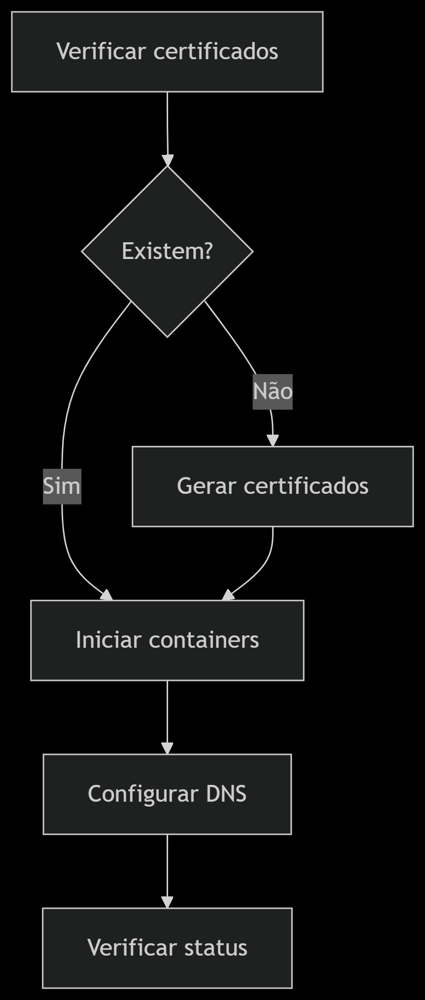
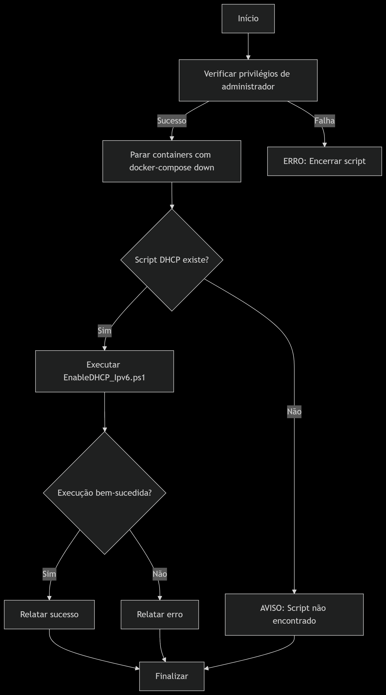

# 🌐 Projeto Final - ASA | Provedor de Serviços de Internet com Microsserviços

> Disciplina: Administração de Sistemas Abertos (ASA)  
> Professor: Sales Filho  
> Duração: 8 semanas  
> Instituição: IFRN - Campus Currais Novos

## 👥 Equipe

- [@eduardobezerraz](https://github.com/eduardobezerraz) - José Eduardo Bezerra de Medeiros  
- [@joao-victor212](https://github.com/joao-victor212) - João Victor  
- [@joaommcjm](https://github.com/joaommcjm) - João Marcos Medeiros Costa  
- [@Luigibalacoder](https://github.com/Luigibalacoder) - Luigi V. Pini  

---

## 📌 Descrição

Este projeto tem como objetivo a implementação de uma **infraestrutura para Provedor de Serviços de Internet (ISP)** utilizando **microsserviços e Docker**, aplicando os princípios de *Infrastructure as Code (IaC)* e *DevOps*. O sistema é modular, seguro e escalável, contemplando serviços como:

- DNS (com Bind9)  
- Correio Eletrônico (com Postfix e Dovecot)  
- Proxy reverso com SSL/TLS (via Nginx, HAProxy, Apache ou Traefik)  

---

## 🎯 Objetivos SMART

- [x] Desenvolver uma infraestrutura baseada em Docker para ISPs  
- [x] Isolar serviços por cliente usando Docker Networks e ACLs  
- [x] Aplicar criptografia com HTTPS e STARTTLS  
- [x] Criar testes automatizados e documentação em vídeo  
- [x] Validar desempenho com métricas (latência, disponibilidade)  
- [x] Cumprir entregas parciais em 4 sprints (8 semanas)  

---

## 🧱 Arquitetura

Abaixo, a representação da arquitetura da rede do ISP implementada no projeto:


---

## 📂 Estrutura de Diretórios

```bash
.
├── docker-compose.yml
├── README.md
├── startup.ps1
├── shutdown.ps1
│
├── DNS
│   ├── Dockerfile
│   ├── named.conf.local
│   └── sonserina.br
│
├── docs
│   └── arquitetura-isp.png
│
├── email
│   ├── Dockerfile
│   ├── dovecot
│   │   └── dovecot.conf
│   ├── postfix
│   │   └── main.cf
│   └── scripts
│       └── init.sh
│
├── Portal
│   ├── Dockerfile
│   └── index.html
│
├── proxy
│   ├── 404.html
│   ├── default.conf
│   ├── Dockerfile
│   ├── index.html
│   └── ssl
│       ├── sonserina.crt
│       └── sonserina.key
│
├── scripts
│   ├── DNSconfig.ps1
│   ├── EnableDHCP_Ipv6.ps1
│   ├── generate-ssl.ps1
│   └── generate-ssl.sh
└─
```
### Descrição dos Diretórios

- **DNS**: Configurações do servidor DNS (Bind9).
- **docs**: Documentação e diagramas do projeto.
- **email**: Serviços de e-mail (Postfix + Dovecot).
- **Portal**: Páginas web estáticas.
- **proxy**: Configurações do proxy reverso (Nginx).
- **scripts**: Scripts auxiliares para configuração e automação.

---

## Pré-requisitos

- Docker e Docker Compose instalados
  - [Instruções para Windows](https://docs.docker.com/desktop/install/windows-install/)
  - [Instruções para Linux](https://docs.docker.com/engine/install/)
- PowerShell (Windows) ou PowerShell Core (Linux/Mac)
- Acesso de administrador/root

### Como Executar

1. Abra o PowerShell com privilégios administrativos (Executar como Administrador).

2. Navegue até o diretório onde os scripts estão salvos:

   

3. Execute o script de inicialização com o comando: 
```powershell
powershell -ExecutionPolicy Bypass -File .\startup.ps1
```
#### O que acontece:
<p align="center">
  
</p>

      ✅ Verificação de privilégios de administrador
      
      🔒 Geração automática de certificados SSL (se necessário)
      
      🐳 Inicialização dos containers Docker com --force-recreate
      
      🌐 Configuração automática do DNS
      
      📊 Exibição do status final dos serviços


4. Execute o script de finalização com o comando: 
```powershell
powershell -ExecutionPolicy Bypass -File .\shutdown.ps1
```
#### O que acontece:
<p align="center">
  
</p>

      🛑 Contêineres Docker são parados
      
      ♻️ Configurações DHCP são restauradas
      
      🌐 Configurações de rede originais são reaplicadas
      
      ✅ Confirmação de desligamento completo

