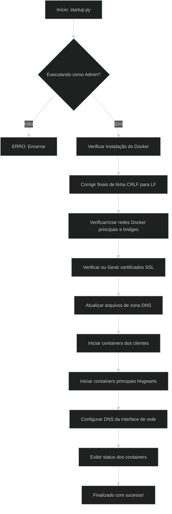
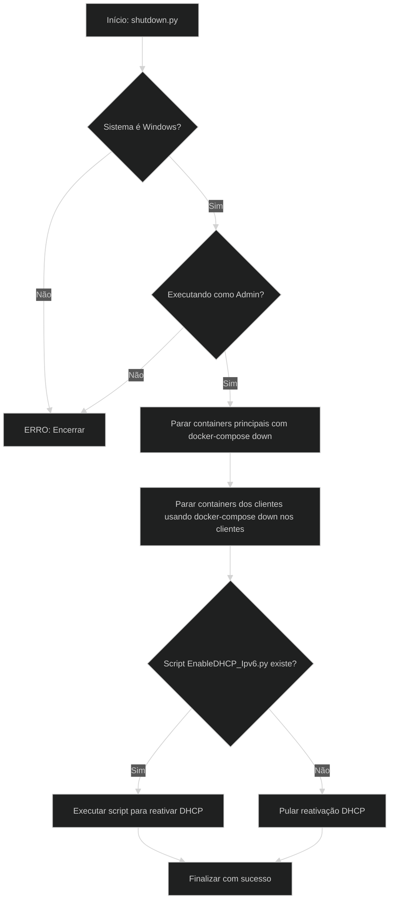

# 🌐 Projeto Final - ASA | Provedor de Serviços de Internet com Microsserviços

> Disciplina: Administração de Sistemas Abertos (ASA)  
> Professor: Sales Filho  
> Duração: 8 semanas  
> Instituição: IFRN - Campus Natal Central

## 👥 Equipe
<div align="center">
  
| Foto | Nome | GitHub |
|------|------|--------|
|  | José Eduardo Bezerra de Medeiros | [@eduardobezerraz](https://github.com/eduardobezerraz) |
|  | João Victor | [@joao-victor212](https://github.com/joao-victor212) |
|  | João Marcos Medeiros Costa | [@joaommcjm](https://github.com/joaommcjm) |
|  | Heyson Silva | [@heysonsilva](https://github.com/heysonsilva) |
</div>

## 📌 Descrição

Este projeto tem como objetivo a implementação de uma **infraestrutura para Provedor de Serviços de Internet (ISP)** utilizando **microsserviços e Docker**, aplicando os princípios de *Infrastructure as Code (IaC)* e *DevOps*. O sistema é modular, seguro e escalável, contemplando serviços como:

- **DNS**: Bind9 com zonas configuráveis  
- **E-mail**: Postfix (SMTP) + Dovecot (IMAP) + Roundcube  
- **Proxy**: Nginx com SSL/TLS automático  
- **Portais**: Hotsites e área do cliente  

**Destaques técnicos**:  
- Automação via scripts PowerShell e ShellScript
- Certificados SSL auto-gerados  
- Isolamento por cliente  
- Configuração IaC com Docker Compose
  
<div align="center">
  
## 🎯 Objetivos do projeto:

| Objetivo | Status |
|----------|:--------:|
| Desenvolver uma infraestrutura baseada em Docker para ISPs | [] |
| Isolar serviços por cliente usando Docker Networks e ACLs | [] |
| Aplicar criptografia com HTTPS| [] |
| Criar testes automatizados e documentação em vídeo | [] |
| Validar desempenho com métricas (latência, disponibilidade) | [] |
| Cumprir entregas parciais em 4 sprints (8 semanas) | [] |

</div>


## 🧱 Arquitetura

Abaixo, a representação da arquitetura da rede do ISP implementada no projeto:


---
## 📂 Explicação dos Diretórios do Projeto

### **[📁 clientes/](./clientes)**
Contém configurações e serviços dedicados para cada cliente do provedor (`corvinal/`, `grifinoria/`, `sonserina/`).  
Cada cliente possui:
- `hotsite/` *(apenas em sonserina)*: Site institucional simples.
- `portal/`: Área de autoatendimento web.
- `proxy/`: Configurações de proxy reverso (Nginx) com certificados SSL dedicados.
- `scripts/`: Automação de geração de certificados.

Arquivo principal por cliente:
- `docker-compose_<cliente>.yaml`: Orquestração Docker dos serviços do cliente.

---

### **[📁 hogwarts/](./hogwarts)**
Infraestrutura central do provedor (ISP). Inclui:

- **[DNS/](./hogwarts/DNS)**  
  Servidor DNS (Bind9):  
  - Arquivos de zona (`corvinal.br`, `grifinoria.br`, `sonserina.br`, `hogwarts.br`)  
  - `named.conf.local`: Definição das zonas DNS  
  - `Dockerfile`: Configuração do container  

- **[email/](./hogwarts/email)**  
  Implementação do serviço de e-mail:  
  - `postfix/`: Configuração SMTP  
  - `dovecot/`: Autenticação IMAP/POP3  
  - `conf.d/`: Ajustes adicionais  
  - `scripts/`: Script de inicialização (`init.sh`)  

- **[Portal/](./hogwarts/Portal)**  
  Portal institucional do ISP.  
  - `Dockerfile` e `index.html`  

- **[proxy/](./hogwarts/proxy)**  
  Proxy reverso (Nginx) central:  
  - `default.conf`: Configuração principal  
  - `ssl/`: Certificados digitais (hogwarts.br e `dhparam.pem`)  

- **[webmail/](./hogwarts/webmail)**  
  Interface Roundcube para acesso aos e-mails:  
  - `config/config.inc.php`: Configuração principal  

Arquivo principal:
- `docker-compose.yml`: Orquestração central dos serviços do ISP.

---

### **[📁 docs/](./docs)**
Documentação do projeto:
- `arquitetura-isp.png`: Diagrama da arquitetura do provedor
- `fluxo_startup.png`: Fluxo de inicialização
- `fluxo_shutdown.png`: Fluxo de desligamento

---

### **[📁 scripts/](./scripts)**
Scripts gerais de automação para todo o projeto:
- `atualizar_zona.py`: Atualização de zonas DNS
- `DNSconfig.py`: Configuração do Bind9
- `EnableDHCP_Ipv6.py`: Ativação de DHCP IPv6
- `fix_line_endings.py`: Correção de finais de linha
- `gerar_certificado.py`: Geração de certificados SSL genéricos

---

### **Arquivos Raiz Principais**
- `startup.py` / `shutdown.py`: Scripts de controle dos containers
- `README.md`: Documentação principal do projeto


## 📂 Estrutura Completa do Projeto em fluxograma

```mermaid
flowchart LR
    root["📁 / (root)"]
    root --> readme["README.md"]
    root --> shutdown["shutdown.py"]
    root --> startup["startup.py"]

    %% Clientes
    root --> clientes["📁 clientes"]

    %% Corvinal
    clientes --> corvinal["📁 corvinal"]
    corvinal --> corvinal_compose["docker-compose_corvinal.yaml"]
    corvinal --> corvinal_portal["📁 portal"]
    corvinal_portal --> corvinal_portal_docker["Dockerfile"]
    corvinal_portal --> corvinal_portal_index["index.html"]
    corvinal --> corvinal_proxy["📁 proxy"]
    corvinal_proxy --> corvinal_proxy_conf["default.conf"]
    corvinal_proxy --> corvinal_proxy_docker["Dockerfile"]
    corvinal_proxy --> corvinal_ssl["📁 ssl"]
    corvinal_ssl --> corvinal_crt["corvinal.br.crt"]
    corvinal_ssl --> corvinal_csr["corvinal.br.csr"]
    corvinal_ssl --> corvinal_key["corvinal.br.key"]
    corvinal --> corvinal_scripts["📁 scripts"]
    corvinal_scripts --> corvinal_cert["gerar_certificado.py"]

    %% Grifinoria
    clientes --> grifinoria["📁 grifinoria"]
    grifinoria --> grifinoria_compose["docker-compose_grifinoria.yaml"]
    grifinoria --> grifinoria_portal["📁 portal"]
    grifinoria_portal --> grifinoria_portal_docker["Dockerfile"]
    grifinoria_portal --> grifinoria_portal_index["index.html"]
    grifinoria --> grifinoria_proxy["📁 proxy"]
    grifinoria_proxy --> grifinoria_proxy_conf["default.conf"]
    grifinoria_proxy --> grifinoria_proxy_docker["Dockerfile"]
    grifinoria_proxy --> grifinoria_ssl["📁 ssl"]
    grifinoria_ssl --> grifinoria_crt["grifinoria.br.crt"]
    grifinoria_ssl --> grifinoria_csr["grifinoria.br.csr"]
    grifinoria_ssl --> grifinoria_key["grifinoria.br.key"]
    grifinoria --> grifinoria_scripts["📁 scripts"]
    grifinoria_scripts --> grifinoria_cert["gerar_certificado.py"]

    %% Sonserina
    clientes --> sonserina["📁 sonserina"]
    sonserina --> sonserina_compose["docker-compose_sonserina.yaml"]
    sonserina --> sonserina_hotsite["📁 hotsite"]
    sonserina_hotsite --> sonserina_hotsite_docker["Dockerfile"]
    sonserina_hotsite --> sonserina_hotsite_index["index.html"]
    sonserina --> sonserina_portal["📁 portal"]
    sonserina_portal --> sonserina_portal_docker["Dockerfile"]
    sonserina_portal --> sonserina_portal_index["index.html"]
    sonserina --> sonserina_proxy["📁 proxy"]
    sonserina_proxy --> sonserina_proxy_conf["default.conf"]
    sonserina_proxy --> sonserina_proxy_docker["Dockerfile"]
    sonserina_proxy --> sonserina_proxy_index["index.html"]
    sonserina_proxy --> sonserina_ssl["📁 ssl"]
    sonserina_ssl --> sonserina_crt["sonserina.br.crt"]
    sonserina_ssl --> sonserina_csr["sonserina.br.csr"]
    sonserina_ssl --> sonserina_key["sonserina.br.key"]
    sonserina_ssl --> corvinal_ref_crt["corvinal.br.crt"]
    sonserina_ssl --> corvinal_ref_key["corvinal.br.key"]
    sonserina_ssl --> grifinoria_ref_crt["grifinoria.br.crt"]
    sonserina_ssl --> grifinoria_ref_key["grifinoria.br.key"]
    sonserina --> sonserina_scripts["📁 scripts"]
    sonserina_scripts --> sonserina_cert["gerar_certificado.py"]

    %% Docs
    root --> docs["📁 docs"]
    docs --> arq["arquitetura-isp.png"]
    docs --> fluxo_start["fluxo_startup.png"]
    docs --> fluxo_shutdown["fluxo_shutdown.png"]

    %% Hogwarts
    root --> hogwarts["📁 hogwarts"]
    hogwarts --> hogwarts_compose["docker-compose.yml"]

    %% DNS
    hogwarts --> dns["📁 DNS"]
    dns --> dns_docker["Dockerfile"]
    dns --> dns_named["named.conf.local"]
    dns --> dns_corvinal["corvinal.br"]
    dns --> dns_grifinoria["grifinoria.br"]
    dns --> dns_hogwarts["hogwarts.br"]
    dns --> dns_sonserina["sonserina.br"]

    %% Email
    hogwarts --> email["📁 email"]
    email --> email_docker["Dockerfile"]
    email --> confd["📁 conf.d"]
    confd --> master_conf["10-master.conf"]
    email --> dovecot["📁 dovecot"]
    dovecot --> dovecot_conf["dovecot.conf"]
    email --> postfix["📁 postfix"]
    postfix --> postfix_conf["main.cf"]
    email --> email_scripts["📁 scripts"]
    email_scripts --> init_sh["init.sh"]

    %% Portal
    hogwarts --> hogwarts_portal["📁 Portal"]
    hogwarts_portal --> hogwarts_portal_docker["Dockerfile"]
    hogwarts_portal --> hogwarts_portal_index["index.html"]

    %% Proxy
    hogwarts --> hogwarts_proxy["📁 proxy"]
    hogwarts_proxy --> hogwarts_proxy_conf["default.conf"]
    hogwarts_proxy --> hogwarts_proxy_docker["Dockerfile"]
    hogwarts_proxy --> hogwarts_proxy_index["index.html"]
    hogwarts_proxy --> proxy_ssl["📁 ssl"]
    proxy_ssl --> hogwarts_crt["hogwarts.br.crt"]
    proxy_ssl --> hogwarts_csr["hogwarts.br.csr"]
    proxy_ssl --> hogwarts_key["hogwarts.br.key"]
    proxy_ssl --> dhparam["dhparam.pem"]

    %% Webmail
    hogwarts --> webmail["📁 webmail"]
    webmail --> webmail_docker["Dockerfile"]
    webmail --> webmail_config["📁 config"]
    webmail_config --> webmail_conf["config.inc.php"]

    %% Scripts
    root --> scripts["📁 scripts"]
    scripts --> atualizar_zona["atualizar_zona.py"]
    scripts --> dnsconfig["DNSconfig.py"]
    scripts --> enable_dhcp["EnableDHCP_Ipv6.py"]
    scripts --> fix_line["fix_line_endings.py"]
    scripts --> gerar_cert["gerar_certificado.py"]

```

---

## Pré-requisitos:

- [Docker](https://docs.docker.com/get-docker/) e [Docker Compose](https://docs.docker.com/compose/install/) instalados  
- [Python 3](https://www.python.org/downloads/) instalado (versão 3.8 ou superior)  
- Acesso de administrador/root  

## Como Executar:

1. Abra um terminal com privilégios administrativos (PowerShell, CMD).  

2. Navegue até o diretório do projeto:  

3. Execute o script de inicialização com o comando: 
```bash
python3 startup.py
```

4. Execute o script de finalização com o comando: 
```bash
python3 shutdown.py
```
Obs: Os scripts foram feitos para serem utilizados em computadores windows.

## Fluxograma da lógica do script de inicialização:


## Fluxograma da lógica do script de finalização:

