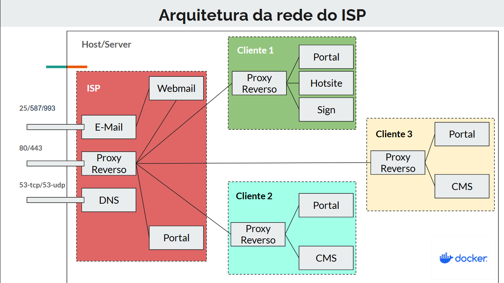
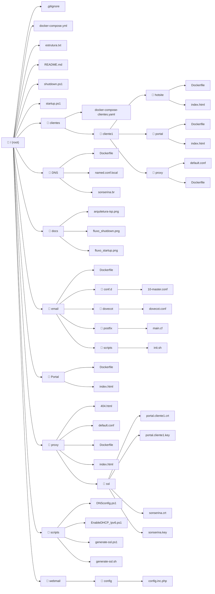
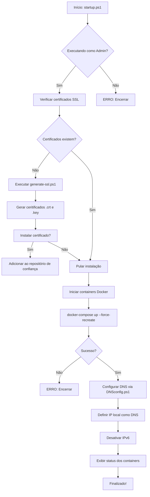
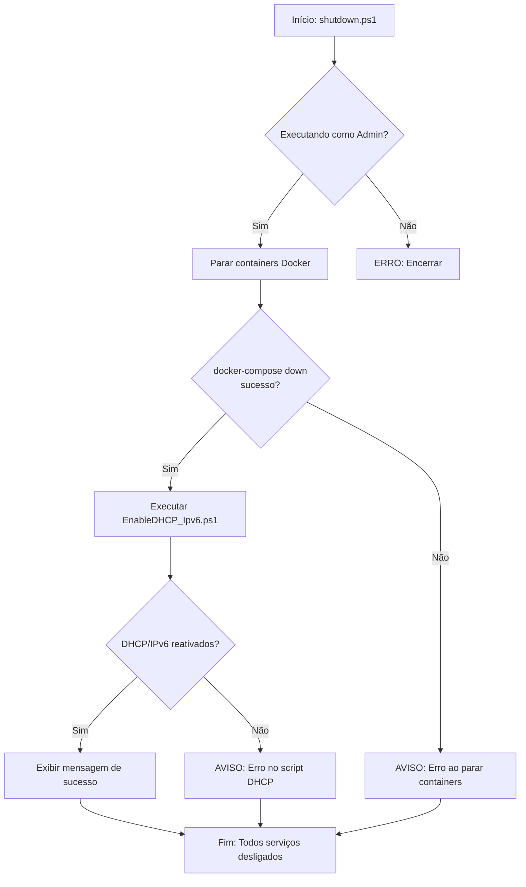

# 🌐 Projeto Final - ASA | Provedor de Serviços de Internet com Microsserviços

> Disciplina: Administração de Sistemas Abertos (ASA)  
> Professor: Sales Filho  
> Duração: 8 semanas  
> Instituição: IFRN - Campus Currais Novos

## 👥 Equipe

- [@eduardobezerraz](https://github.com/eduardobezerraz) - José Eduardo Bezerra de Medeiros  
- [@joao-victor212](https://github.com/joao-victor212) - João Victor  
- [@joaommcjm](https://github.com/joaommcjm) - João Marcos Medeiros Costa  
- [@heysonsilva](https://github.com/heysonsilva) - Heyson Silva  

---

## 📌 Descrição

Este projeto tem como objetivo a implementação de uma **infraestrutura para Provedor de Serviços de Internet (ISP)** utilizando **microsserviços e Docker**, aplicando os princípios de *Infrastructure as Code (IaC)* e *DevOps*. O sistema é modular, seguro e escalável, contemplando serviços como:

- DNS (com Bind9)  
- Correio Eletrônico (com Postfix e Dovecot)  
- Proxy reverso com SSL/TLS (via Nginx, HAProxy, Apache ou Traefik)  

---

## 🎯 Objetivos SMART

- [x] Desenvolver uma infraestrutura baseada em Docker para ISPs  
- [x] Isolar serviços por cliente usando Docker Networks e ACLs  
- [x] Aplicar criptografia com HTTPS e STARTTLS  
- [x] Criar testes automatizados e documentação em vídeo  
- [x] Validar desempenho com métricas (latência, disponibilidade)  
- [x] Cumprir entregas parciais em 4 sprints (8 semanas)  

---

## 🧱 Arquitetura

Abaixo, a representação da arquitetura da rede do ISP implementada no projeto:



---
## 📂 Explicação dos Diretórios do Projeto

### **[📁 clientes/](./clientes)**
Diretório que contém configurações específicas para cada cliente do provedor. Cada cliente possui:
- `hotsite/`: Site institucional básico
- `portal/`: Área de autoatendimento
- `proxy/`: Configurações de proxy dedicado

Arquivo principal:
- `docker-compose-clientes.yaml`: Configuração Docker para serviços dos clientes

### **[📁 DNS/](./DNS)**
Configurações do servidor DNS (Bind9) contendo:
- `Dockerfile`: Configuração do container
- `named.conf.local`: Definição das zonas DNS
- `sonserina.br`: Arquivo de zona DNS principal

### **[📁 docs/](./docs)**
Armazena toda a documentação do projeto:
- Diagramas de arquitetura
- Fluxogramas dos scripts
- Documentação complementar

### **[📁 email/](./email)**
Implementação completa de serviço de e-mail com:
- `Dockerfile`: Configuração principal
- `conf.d/`: Configurações adicionais
- `dovecot/`: Autenticação IMAP/POP3
- `postfix/`: Servidor SMTP
- `scripts/`: Scripts auxiliares

### **[📁 Portal/](./Portal)**
Portal institucional do provedor contendo:
- `Dockerfile`: Configuração do container
- `index.html`: Página web principal

### **[📁 proxy/](./proxy)**
Configurações do proxy reverso (Nginx) com:
- Arquivos de configuração principal
- Páginas de erro
- `ssl/`: Certificados digitais
  - Certificados raiz
  - Certificados por cliente

### **[📁 scripts/](./scripts)**
Scripts de automação para:
- Configuração de DNS
- Gerenciamento de rede
- Geração de certificados SSL
- Ativação/desativação de serviços

### **[📁 webmail/](./webmail)**
Interface web para e-mails (Roundcube) com:
- `config/`: Configurações de conexão
  - `config.inc.php`: Configuração principal

### **Arquivos Raiz Principais**
- `docker-compose.yml`: Orquestração central
- `startup.ps1`/`shutdown.ps1`: Scripts de controle
- `README.md`: Documentação principal

## 📂 Estrutura Completa do Projeto em fluxograma

---

## Pré-requisitos

- Docker e Docker Compose instalados
  - [Instruções para Windows](https://docs.docker.com/desktop/install/windows-install/)
  - [Instruções para Linux](https://docs.docker.com/engine/install/)
- PowerShell (Windows) ou PowerShell Core (Linux/Mac)
- Acesso de administrador/root

## Como Executar


1. Abra o PowerShell com privilégios administrativos (Executar como Administrador).

2. Navegue até o diretório onde os scripts estão salvos:

3. Execute o script de inicialização com o comando: 
```powershell
powershell -ExecutionPolicy Bypass -File .\startup.ps1
```

4. Execute o script de finalização com o comando: 
```powershell
powershell -ExecutionPolicy Bypass -File .\shutdown.ps1
```
## Fluxograma da lógica do script de inicialização:


## Fluxograma da lógica do script de finalização:

